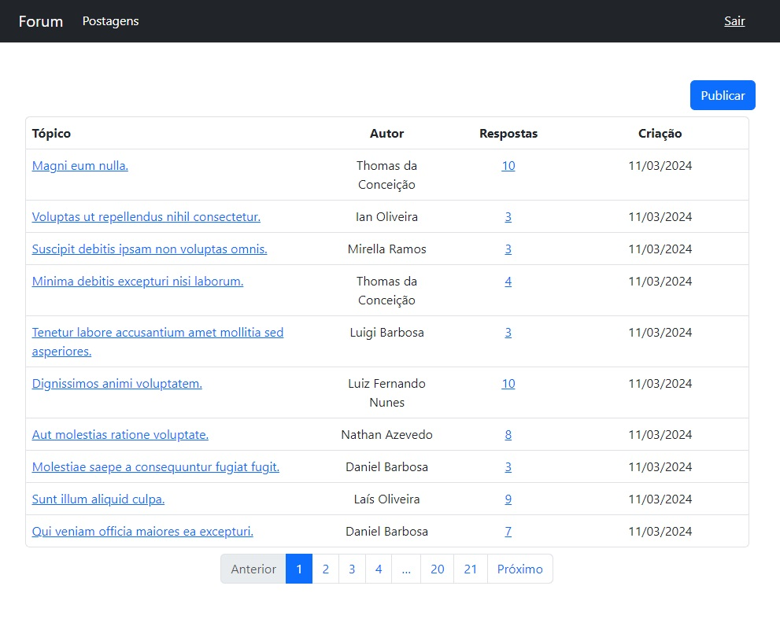
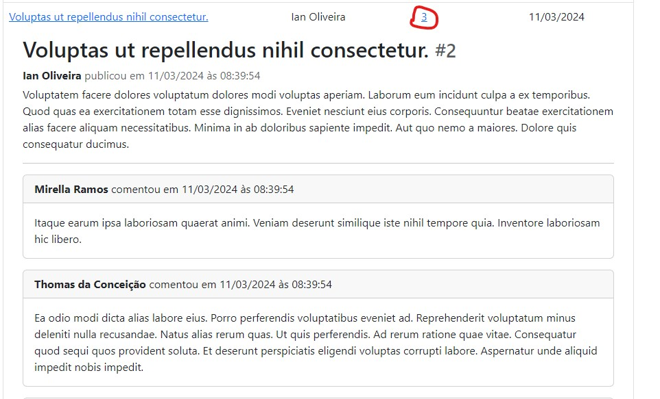
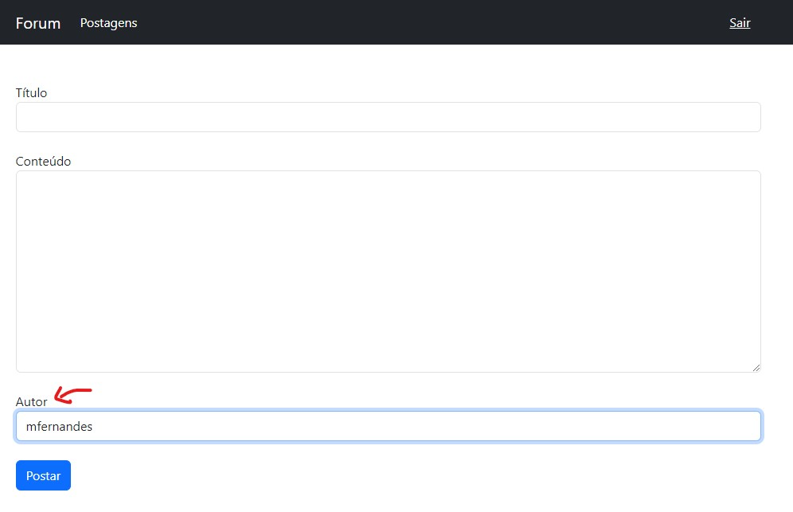

# Novadata Code Challenge

Este repositório é parte do desafio de desenvolvimento para a vaga de Desenvolvedor Backend Pleno da Novadata.

O desafio consiste em implementar um sistema de postagem e comentários seguindo os
requisitos disposto [neste documento](https://raw.githubusercontent.com/jraylan/novadata_code_challenge/250a99a5bed9e38cbb01f769d76ff0f3cba4043e/doc/Teste_Django.pdf).


## Dependências
- [Python](https://www.python.org/downloads/) - Versão 3.10+
- [django](https://www.djangoproject.com) == 5.0.3
- [djangorestframework](https://www.django-rest-framework.org/) == 3.14
- [fake](https://github.com/joke2k/faker) == 0.8

## Instalação:

1. Instalar as bibliotecas/pacotes (no Linux baseado em Debian):

```bash
sudo apt update
sudo apt install -y python3 python3-pip
```
Caso a versão do python do seu OS seja anterior à versão 3.10 é necessário consultar como instalar a versão 3.10 do python no seu sistema.

1. Clone o repositório:

```bash
cd /usr/local
git clone https://github.com/jraylan/novadata_code_challenge.git
```


3. Instalar dependências:

```bash
cd /usr/local/novadata_code_challenge
pip install -r requirements.txt
```


4. Sincronize a base de dados:

```bash
cd /usr/local/novadata_code_challenge
python3 manage.py migrate
```

5. Carregue os fixtures:

```bash
python3 manage.py loaddata test_db_backup.json
```


6. Execute os testes unitários:
```bash
python3 manage.py test
```


7. Inicie o servidor de desenvolvimento:
```bash
python3 manage.py runserver
```

Acesse [http://localhost:8000/forum](http://localhost:8000/forum). Use o usuário/senha admin/admin.

Uma coleção do Postman com todas as requisições à API está disponível [neste link](https://www.postman.com/jeffersonraylan/workspace/novadata/collection/8168733-b6125a1d-47c3-490e-9488-130e120ee6cc?action=share&creator=8168733).


## Considerações
Devido a compromissos previamente definidos, só foi possível iniciar o desafio na tarde do dia
10/03. Por isso, alguns polimentos não pode ser aplicado a tempo. Contudo, todas as especificações
solicitadas foram atendias. Aqui estão algumas considerações levantadas durante a realização do desafio.

### Adaptações ao layout
Alguns requisitos solicitados tiveram que ser adaptado ao layout de uma forma que o design se mantivesse limpo. Estas adaptações serão
detalhadas abaixo.

#### Listagem de comentários na lista de postagens
Um dos requisitos é que na lista de postagens deveria haver os comentários das postagens. Esta funcionalidade foi adicionada, para ver
os comentários basta clicar no link na coluna com o número de comentários.



#### Selecionar autor na criação de postagens
Outro requisito documentado é a possibilidade de selecionar o autor do post na criação do mesmo. Na API, eu segui a abordagem que eu
seguiria caso este requisito não fosse exposto: o autor do post é o usuário que fez a requisição. O mesmo vale para os comentário, tanto pela API quanto pelo template.

